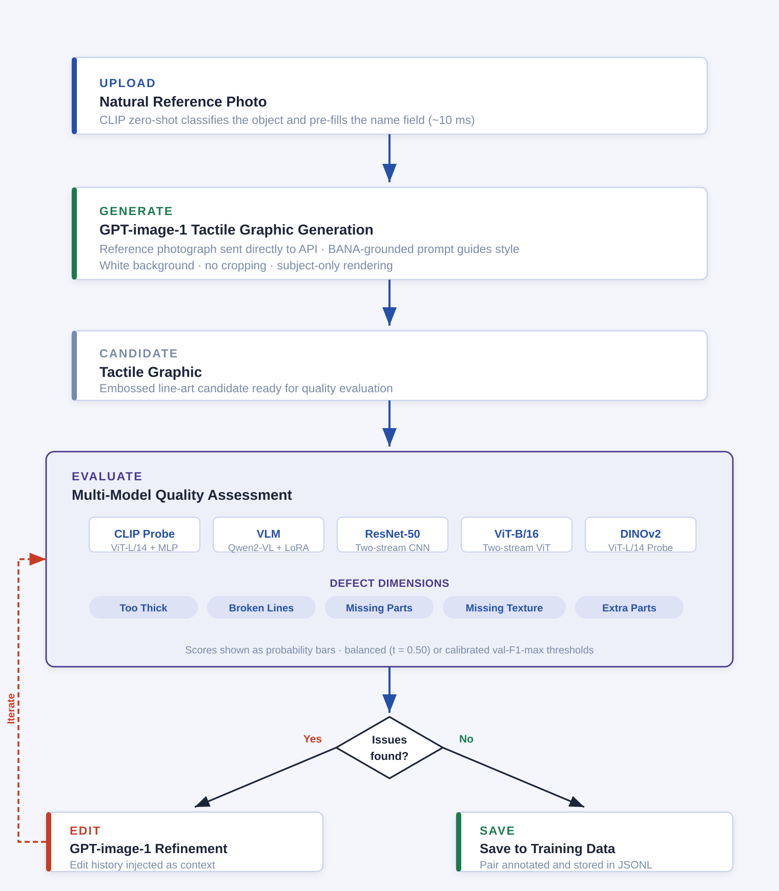

# TactileExpert — Status Meeting · 9 July 2026

**A human-in-the-loop system that generates tactile graphics for blind and visually impaired (BVI) learners, judges its own output with a panel of trained evaluator models, and gets better every time a human corrects it.**



---

## 1. Motivation

Tactile graphics — embossed line drawings that BVI students read with their fingertips — are essential learning materials, but making one is slow and needs an expert. Image generators like GPT-image-1 can draft them in seconds, but the drafts have defects a sighted designer would catch instantly: lines too thick to tell apart, gaps in outlines, missing parts, missing texture, invented extras.

So the question this project answers is: **can we teach models to catch those defects, so a human only has to make the final call — and can every human correction make the system smarter?**

The system has three jobs:

1. **Generate** a tactile graphic from a photo, following BANA (Braille Authority of North America) design rules.
2. **Evaluate** it with five independently trained models — each scoring the same five defect dimensions — plus a weighted ensemble that combines their votes.
3. **Learn** from the human: every edit instruction, every corrected label, and every accepted or rejected suggestion is logged as training data.

---

## 2. The pipeline, step by step

| Step | What happens |
|---|---|
| **1. Upload** | User uploads a natural reference photo. CLIP zero-shot identifies the object and pre-fills its name (~10 ms). |
| **2. Generate** | GPT-image-1 draws a tactile graphic candidate from the photo, guided by a BANA-grounded prompt (plain white background, continuous bold outlines, distinct texture fills, no text or logos, no invented elements). |
| **3. Evaluate** | The evaluator panel scores the candidate on five defect dimensions. The UI shows the **ensemble verdict card** — issues flagged, ordered by priority, each with a suggested edit — with the full per-model decision table one click away. |
| **4. Edit** | The top-priority suggestion pre-fills the edit box (naming the actual object, e.g. *"close the broken lines so every outline of the motorcycle is continuous"*). The user adjusts or rewrites it, picks which defect the edit targets, and applies. GPT-image-1 edits the image; the panel re-scores it. |
| **5. Iterate** | Repeat inspect → edit until the image is right. Every step is logged: scores before and after, the instruction, the target defect, and whether the suggestion was accepted or rewritten. |
| **6. Save** | The user reviews five defect checkboxes against the final image (the ground truth), and saves. One save writes the image pair, the final labels, and the full step-by-step trajectory. |

The OpenAI API key is entered in the UI per session and never stored.

---

## 3. The judges: five models + one ensemble

All five models answer the same five questions about a (photo, tactile) pair: **Too Thick? Broken Lines? Missing Parts? Missing Texture? Extra Parts?** Each answer is a probability.

| Model | Backbone | Trainable part | Input → Output |
|---|---|---|---|
| **CLIP Probe** | CLIP ViT-L/14 (frozen) | Per-dimension 2-layer MLP heads | 2 images → 768-d CLS each → concat **[nat \| tac] = 1536-d** → head → P(defect) |
| **DINOv2 Probe** | DINOv2 ViT-L/14 (frozen) | Per-dimension 2-layer MLP heads | 2 images → 1024-d CLS each → **[nat \| tac \| nat−tac] = 3072-d** → head → P(defect) |
| **ResNet-50** | Two-stream ResNet-50 | Entire network | 2 × (224×224×3) → 2048-d per stream → late fusion → sigmoid per dimension |
| **ViT-B/16** | Two-stream ViT-B/16 | Entire network | 2 × (224×224×3) → 768-d per stream → late fusion → sigmoid per dimension |
| **VLM** | Qwen2-VL-2B-Instruct | LoRA adapter (r=4, α=8) — **1.09 M of 2.21 B params (0.05%)**, vision encoder frozen | 2 images (≤200,704 px each) + a yes/no question per dimension → P("yes") from the yes/no token logits |
| **Ensemble (weighted)** | — (derived) | — | Per dimension: each model votes at its own threshold; votes weighted by that model's per-dimension test F1; **flag if weighted vote share > 0.5**. Probability bar = weighted mean. |

Training details shared by the probe / two-stream models: Asymmetric Loss (γ⁻ = 4.0; γ⁻ = 8.0 on the DINOv2 Missing-Texture head), per-dimension thresholds calibrated on the validation split. The VLM is fine-tuned on question-answer pairs built from the same splits; its Broken-Lines question was reworded to an outline-only definition (*"consider only the structural outlines, not texture fills…"*) after we found the earlier phrasing conflated texture with breakage.

Each checkpoint folder under `models/` carries a `TRAINING_RECIPE.txt` stating exactly what data trained it and its headline results.

---

## 4. Training data

- **987 human-annotated pairs** across six object categories — every pair labeled by a human for all five defect dimensions.
- **~120 GPT-generated pairs** (growing daily) collected through the pipeline itself, each with checkbox-verified final labels.
- **Inferred labels from edit actions**: when the user targets a defect with an edit, the pre-edit image is labeled positive for that defect — the action itself is the label.
- **A frozen GPT-domain holdout** (every 5th collected pair, never trained on) measures whether the models are actually learning the new domain.

---

## 5. Results

Deployed fleet: each model ships its best available checkpoint (per-model selection documented in `models/*/TRAINING_RECIPE.txt`). All numbers below are measured on this exact serving fleet at a uniform threshold t = 0.50.

### Original test set (153 pairs) — F1 per dimension

| Dimension | CLIP Probe | VLM | ResNet-50 | ViT-B/16 | DINOv2 Probe | Ensemble |
|---|:---:|:---:|:---:|:---:|:---:|:---:|
| Too Thick | 0.591 | 0.393 | 0.515 | 0.549 | **0.622** | 0.593 |
| Broken Lines | 0.620 | 0.634 | 0.571 | 0.607 | 0.556 | **0.661** |
| Missing Parts | 0.626 | 0.614 | 0.690 | 0.686 | **0.722** | 0.699 |
| Missing Texture | 0.887 | 0.861 | 0.884 | 0.838 | 0.884 | **0.897** |
| Extra Parts | 0.432 | 0.270 | 0.406 | 0.290 | 0.405 | **0.457** |
| **Macro F1** | 0.631 | 0.554 | 0.614 | 0.594 | 0.638 | **0.661** |

### Original test set — AUC (threshold-independent)

| Dimension | CLIP Probe | VLM | ResNet-50 | ViT-B/16 | DINOv2 Probe | Ensemble |
|---|:---:|:---:|:---:|:---:|:---:|:---:|
| Too Thick | 0.807 | 0.759 | 0.753 | 0.818 | 0.828 | **0.876** |
| Broken Lines | 0.731 | **0.799** | 0.692 | 0.730 | 0.690 | 0.783 |
| Missing Parts | 0.719 | 0.657 | 0.781 | 0.781 | 0.757 | **0.786** |
| Missing Texture | **0.847** | 0.684 | 0.772 | 0.755 | 0.773 | 0.835 |
| Extra Parts | 0.767 | 0.729 | 0.701 | 0.683 | 0.720 | **0.768** |
| **Macro AUC** | 0.774 | 0.726 | 0.740 | 0.753 | 0.754 | **0.809** |

**The weighted ensemble is the strongest judge overall** — best macro F1 (0.661) and best macro AUC (0.809), ahead of every individual model. Its weights are per-dimension F1 scores, so a model that is weak on a dimension automatically loses influence there.

*Note: the VLM column understates its practical performance — at a uniform t = 0.50 its conservative calibration hurts it, but the app's calibrated mode uses its per-dimension thresholds (0.05–0.25), where its F1 is substantially higher.*

### GPT-domain holdout (12 pairs, 60 flag decisions) — correct flags

| | CLIP Probe | VLM | ResNet-50 | ViT-B/16 | DINOv2 Probe | Ensemble |
|---|:---:|:---:|:---:|:---:|:---:|:---:|
| Correct / total | 36/60 | **45/60** | 35/60 | 31/60 | 26/60 | 37/60 |

*The holdout is heavily clean (4 positive labels of 60), so a judge that always answers "clean" would score 56/60 — read this table as a false-alarm measure. All models still over-flag generated images; the VLM over-flags least. Closing this gap is what the ongoing data collection is for.*

### Zero-shot baselines (why fine-tuning matters)

We asked strong general-purpose models the same questions with **no training at all**, on 48 collected pairs (240 decisions; a trivial judge that always answers "clean" scores 226/240):

| Zero-shot judge | Correct | False alarms |
|---|:---:|:---:|
| *always answer "clean"* | *226/240* | *0* |
| CLIP ViT-L/14 (prompt matching) | 149/240 | 83 |
| Qwen2-VL-7B (3.5× our VLM's size) | 119/240 | 114 |
| Qwen2-VL-2B (same base as our VLM) | 51/240 | 188 |

**Every zero-shot generalist scores far below the trivial baseline** — they raise alarms on nearly everything. After fine-tuning on our data, the *same* 2B model became the best judge in the fleet. Off-the-shelf models cannot do this task; domain training is what makes it work.

---

## 6. What the data has taught us so far (open problems, honestly)

- **Dashed textures get mistaken for broken lines.** A duck whose body is filled with neat rows of tactile dashes — good design — sets off the "broken lines" alarm in most models. They learned "many short line fragments ≈ broken" instead of "gaps in the outline ≈ broken". Rewording the question at inference time made it *worse* (telling a model to ignore dashes makes it stare at the dashes); retraining with the corrected definition helps but hasn't fully fixed it.
- **Real outline gaps sometimes get missed** by the same models that over-flag textures — the concept is genuinely mislearned, not just miscalibrated. Fixing it needs contrast examples: textured-but-clean images labeled clean, genuinely-broken images labeled broken. Our collection produces exactly these.
- **"Extra parts" is a meaning question, not a pixels question.** Whether a shape *belongs* depends on knowing what the object is. The two language-aware models (CLIP, VLM) improved on it after retraining; the three pure-vision models got worse. Language supervision seems to carry semantic defect concepts across drawing styles.
- **Evaluators over-flag any new drawing style until they've seen it.** On newly collected GPT-style images, over a third of all flags initially disagreed with the human — almost all false alarms. One retrain cut the best model's false alarms nearly in half. The gap is data, not architecture.

---

## 7. Ongoing work — the reinforcement-learning story

Every session in the pipeline quietly produces the three ingredients of reinforcement learning:

- **State** — the current image pair and its evaluator scores.
- **Action** — the edit instruction the human actually gave, plus which defect it targeted.
- **Reward** — how much the defect scores improved after the edit.

On top of the final labels, we log two kinds of *disagreement*, and each one trains a different part of the system:

1. **Human vs. evaluators** (corrected checkboxes) → retrains the evaluators. They are our *reward model*, and the human keeps them honest.
2. **Human vs. suggestion** (the pre-filled edit vs. what the user actually typed) → preference pairs for training an *edit policy* — a model that learns to write the right edit instruction itself. Suggested-but-rejected = worse; human-written = better. This is exactly the data format DPO (Direct Preference Optimization) trains on.

The flywheel: human corrections → better evaluators → better suggestions → richer trajectories → an edit policy that needs fewer human corrections. The long-term goal is a system that iterates to a clean tactile graphic on its own, with the human only auditing.

**Next steps:** finish the 150-pair collection target · re-derive ensemble weights from live GPT-domain accuracy (the ensemble currently weights by original-domain F1, and live data shows the VLM deserves more weight on generated images) · fine-tune the 7B VLM with the same recipe · behavior-clone the edit policy from logged instructions, then DPO on the preference pairs.

---

## 8. Using the UI

### Start

```bash
sbatch slurm/run_pipeline.sh          # GPU (recommended)
tail -f logs/pipeline_<jobid>.out     # → open the gradio.live URL
bash run_local.sh                     # CPU-only fallback
```

### Controls (left panel)

| Control | What it does |
|---|---|
| **Mode** radio | *Full pipeline* (generate + evaluate + edit) or *Eval only* (upload an existing tactile) |
| **Natural reference photograph** | CLIP auto-detects the object and fills the name field |
| **Object name** | Confirm/correct — drives the BANA prompt *and* the object-grounded edit suggestions |
| **OpenAI API key** | Per session, never stored |
| **Run evaluators** | Which models to run (keep all 5 + Ensemble when saving for training) |
| **Pre-fill edit instruction from** | Which judge's verdict drives the suggestion (default: Ensemble) |
| **Combine all flagged issues in pre-fill** | Off by default — one targeted edit at a time; on = numbered list of every flagged issue |
| **Defect being addressed** | Which defect this edit targets — auto-filled, **change it whenever you override the suggestion** |
| **Re-evaluate current image** | Re-score without a new GPT call |

### Results (right panel)

- **Ensemble verdict card** — issues by priority with suggested edits; expand *"Show full per-model decision table"* for every model's probability bars and the consensus column
- **Iteration gallery + edit log** — every version and every instruction
- **Save to Training** — review every checkbox against the image (your eyes are ground truth), save once

### Per-image flow

```
Upload photo → confirm name → Generate
  → look at the IMAGE first, scores second
  → edit 2–4 times (one defect per edit; flip the dropdown when overriding)
  → Save to Training: verify every checkbox → Save → Reset → next image
```

---

## 9. Repository structure

```
TactileExpert/
├── app.py                        Gradio pipeline UI (ensemble card, trajectory logging)
├── evaluators/
│   ├── constants.py              options, questions, thresholds, ensemble weights + rules
│   ├── clip_probe_eval.py        CLIP ViT-L/14 probe
│   ├── dino_probe_eval.py        DINOv2 ViT-L/14 probe
│   ├── backbone_eval.py          ResNet-50 / ViT-B/16 two-stream
│   └── vlm_eval.py               Qwen2-VL-2B + LoRA
├── generation/gpt_generator.py   GPT-image-1 generate/edit wrappers (BANA prompt)
├── models/                       checkpoints (untracked) + TRAINING_RECIPE.txt per model
├── generated_training_data/      annotations.jsonl · trajectories.jsonl · pair folders (untracked)
├── pipeline_diagram.png
├── slurm/run_pipeline.sh         GPU job script
└── run_local.sh                  CPU-only launch
```

Setup: `pip install -r requirements.txt`; checkpoints go under `models/`; the VLM base model downloads from HuggingFace (`Qwen/Qwen2-VL-2B-Instruct`, set `HF_HOME`).

---

## Citation
